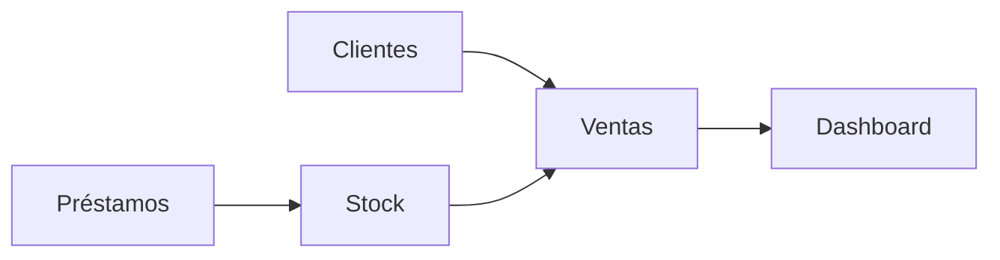

# Manual del sistema — Patrón del Gas

Guía sencilla para entender **qué hace** el sistema, **cómo se usa** en el día a día y **qué ves** en cada pantalla. Está pensada para dueños, administrativos o cualquier persona que opere el panel sin conocimientos técnicos.

---

## Tabla de contenidos

1. [¿Qué es este sistema?](#1-qué-es-este-sistema)
2. [Cómo entrar](#2-cómo-entrar)
3. [Recorrido general](#3-recorrido-general)
4. [Pantalla principal (Dashboard)](#4-pantalla-principal-dashboard)
5. [Clientes](#5-clientes)
6. [Productos](#6-productos)
7. [Stock](#7-stock)
8. [Ventas](#8-ventas)
9. [Préstamos de envases](#9-préstamos-de-envases)
10. [Tipos de cliente y precios](#10-tipos-de-cliente-y-precios)
11. [Imágenes de apoyo (opcional)](#11-imágenes-de-apoyo-opcional)
12. [Resumen rápido](#12-resumen-rápido)

---

## 1. ¿Qué es este sistema?

**Patrón del Gas** es un **panel web** para la operación diaria de un negocio de garrafas:

| Función | Para qué sirve |
|--------|----------------|
| **Clientes** | Guardar quién compra, teléfono, dirección y **tipo** de cliente (define el precio). |
| **Productos** | Listado de envases (marca y kilos) y **precios** según el tipo de cliente. |
| **Stock** | Cuántas garrafas **llenas** y **vacías** tenés en depósito por cada producto. |
| **Ventas** | Registrar pedidos y cobros; el sistema **descuenta** garrafas llenas y puede **sumar** vacías devueltas. |
| **Préstamos** | Anotar que un cliente **debe** envases vacíos; el sistema puede **descontar** vacías del stock al prestar. |

Todo queda registrado con fechas para consultar después.

---

## 2. Cómo entrar

1. Abrís la dirección del sitio (por ejemplo la que te dio Hostinger).
2. Vas a la pantalla de **Iniciar sesión**.
3. Ingresás **email** y **contraseña** que te asignaron (el administrador los crea en la base de datos con scripts o soporte técnico).

Si el email o la contraseña no coinciden, verás un mensaje de error y no entrás al panel.

> **Nota técnica:** El acceso lo gestiona el dueño o quien administre el servidor (variables de entorno, usuarios en base de datos). Este manual no cubre la creación de usuarios en el hosting.

---

## 3. Recorrido general

Flujo típico de un día:



1. **Cargás o revisás clientes** (sobre todo los nuevos).
2. **Mirás el stock** si hace falta antes de prometer cantidades.
3. **Registrás ventas** cuando entregás o cobrás.
4. Si alguien se lleva vacíos sin dejar vacío, **registrás préstamo** (deuda de envases).
5. El **Dashboard** te muestra totales y gráficos resumidos.

---

## 4. Pantalla principal (Dashboard)

Al entrar ves el **panel principal**. Suele incluir:

- **Recaudación** de hoy, de la semana y del mes (ventas ya **completadas**).
- **Pedidos pendientes** (ventas guardadas como “en camino” que aún no completaste).
- **Cantidad de clientes** registrados.
- **Gráficos** (por ejemplo ingresos por marca en los últimos 15 días, torta por tipo de cliente, barras de stock lleno vs vacío).
- **Últimos movimientos** de stock y **últimas ventas**.

Sirve para una **vista rápida**; el detalle está en cada sección del menú.

---

## 5. Clientes

### Qué permite el sistema

- **Listar** todos los clientes activos.
- **Buscar** por nombre, teléfono, dirección o categoría (hay un buscador en el listado).
- **Agregar** un cliente nuevo.
- **Editar** datos o categoría.

### Datos importantes de un cliente

| Campo | Ejemplo | Importante porque… |
|-------|---------|---------------------|
| Nombre y apellido | “María López” | Identificás al comprador. |
| Teléfono | 11-2345-6789 | Contacto para pedidos. |
| Dirección | Calle Falsa 123 | Referencia de entrega. |
| **Categoría** | Domicilio / Establecimiento / Mayorista | **Define el precio** de las garrafas en la venta. |

### Ejemplo didáctico

> **Situación:** Entra un nuevo bar que compra al precio “sandwichería”.  
> **Qué hacés:** Clientes → **Agregar cliente** → completás datos y elegís categoría **Establecimiento** (en el sistema el nombre técnico es ese; en tu negocio lo llamás “sandwichería / comedor”).  
> **Resultado:** Cuando hagas una venta a ese cliente, el sistema usará los precios de **Establecimiento** para cada marca/kilo.

---

## 6. Productos

### Qué muestra

- Cada **envase** del catálogo: **marca** (por ejemplo HIPERGAS, YPF, VARIGAS) y **peso** (10 kg, 15 kg, etc.).
- Los **precios** no van “sueltos” en el producto: hay **tres precios por producto**, uno por cada **tipo de cliente** (domicilio, establecimiento, mayorista).

### Ejemplo

| Producto | Domicilio | Establecimiento | Mayorista |
|----------|-----------|-----------------|-----------|
| HIPERGAS 10 kg | $19.000 | $17.500 | $15.000 |
| YPF 10 kg | $24.000 | $22.000 | $18.500 |

*(Los valores reales son los que cargó el dueño en la base de datos / seed.)*

Si cambian los precios del mercado, quien administre el sistema actualiza productos o ejecuta scripts de carga según cómo esté armado el proyecto.

---

## 7. Stock

### Qué es “stock lleno” y “stock vacío”

- **Llenas:** garrafas listas para **vender** (entregás llena al cliente).
- **Vacías:** envases vacíos en depósito (las que **recibís** de vuelta o usás para préstamos).

### Qué permite la pantalla

- Ver por cada producto cuántas **llenas** y **vacías** hay.
- **Ajustar** números cuando haga falta (por ejemplo inventario físico), según las herramientas que tenga tu versión del sistema.

### Cómo cambia el stock automáticamente

| Acción | Efecto típico en stock |
|--------|-------------------------|
| **Venta completada** | Bajan **llenas** según lo vendido; pueden subir **vacías** si cargás cuántas devolvió el cliente en el momento. |
| **Préstamo manual** (deuda) | Puede **bajar** el stock de **vacías** si configuraste el negocio así: prestás vacío “de depósito”. |
| **Saldar préstamo** | Cuando el cliente devuelve, suelen **volver a subir** las vacías al depósito (según la lógica del sistema). |

---

## 8. Ventas

### Estados del pedido

Al cargar una venta podés elegir (según pantalla):

| Estado | Significado práctico |
|--------|----------------------|
| **Completado / Entregado** | Ya entregaste y cobrás (o cobraste). **Descuenta garrafas llenas** del stock en ese momento. |
| **Pendiente** | Pedido tomado pero **aún no** descontó stock de llenas: lo completás después desde la venta. |
| **Cancelado** | No se opera como venta válida en curso. |

### Cómo cargar una venta nueva (idea general)

1. **Ventas** → **Nueva venta** (o botón equivalente en el panel).
2. Elegís **cliente** (así el sistema sabe qué **lista de precios** usar).
3. Por cada tipo de garrafa, indicás **cuántas llenas** vendés.
4. Si la venta va **completada**, podés indicar **cuántas vacías** te devolvió el cliente en el acto (no obligatorio en cero).
5. Elegís **método de cobro** (efectivo / transferencia) si aplica.
6. Confirmás.

### Validación de stock (garrafas llenas)

El sistema **no deja** vender más **llenas** de las que hay en stock.

**Ejemplo:**

- Tenés **5** HIPERGAS 15 kg llenas.
- Intentás vender **10**.
- **No se guarda** la venta: aparece un mensaje del tipo *“No alcanza el stock de garrafas llenas: HIPERGAS 15 kg (disponibles: 5, pedidas: 10).”*

Así **no aparecen números negativos** en stock por error de carga.

### Pedidos pendientes

1. Creás el pedido como **Pendiente** (no descuenta llenas todavía).
2. Cuando entregás, entrás a **completar** ese pedido, cargás forma de pago y vacías devueltas si corresponde.
3. Al completar, se aplican las mismas reglas de **stock de llenas** (si ahora no alcanza, **no** completa y avisa).

### Qué **no** hace automáticamente la venta (según la configuración actual)

- **No** suma deuda de préstamo solo porque el cliente no devolvió vacíos: eso lo cargás vos en **Préstamos** si corresponde.

---

## 9. Préstamos de envases

### Idea general

Sirve para llevar la **cuenta corriente de envases vacíos**: cuántos **debe** un cliente por tipo de garrafa (marca/kilo).

### Registrar una deuda

1. **Préstamos** → formulario de registro.
2. Elegís **cliente**, **producto** (marca/kilo) y **cantidad**.
3. Opcional: una **observación** (texto libre).

**Stock vacío:** al registrar, el sistema puede **descontar** del stock de **vacías** ese producto. Si no hay suficientes vacías en depósito, **no** deja guardar y te dice cuántas hay.

### Saldar

En el listado de deudores, el botón tipo **Saldar** indica que el cliente **devolvió** (o se regularizó) esa deuda: el sistema **ajusta** el stock de vacías y cierra ese registro de deuda para ese cliente/producto.

### Ejemplo

> Prestás 2 vacíos de HIPERGAS 10 kg a un cliente sin que venga de una venta recién cargada.  
> Registrás **cantidad 2** en préstamos para ese cliente y producto.  
> Si había 10 vacías en stock, pasan a **8**.  
> Cuando trae los envases, **Saldar** y el stock de vacías vuelve a reflejar la devolución.

---

## 10. Tipos de cliente y precios

En la base de datos los tipos se llaman:

| Nombre en sistema | Suele usarse para… |
|-------------------|-------------------|
| **DOMICILIO** | Clientes finales / casa. |
| **ESTABLECIMIENTO** | Bares, sandwicherías, comedores, etc. |
| **MAYORISTA** | Compra por mayor. |

Cada venta toma el precio del ítem según el **tipo del cliente** elegido en la ficha del cliente.

---

## 11. Imágenes de apoyo (opcional)

Este manual es texto para que **cualquiera** lo lea sin depender de capturas. Si querés enriquecerlo:

1. Creá una carpeta, por ejemplo: `docs/capturas/`.
2. Guardá ahí pantallazos con nombres claros:
   - `01-login.png`
   - `02-dashboard.png`
   - `03-clientes-lista.png`
   - `04-venta-nueva.png`
   - `05-prestamos.png`
3. En este mismo archivo Markdown podés enlazarlos así (cuando existan los archivos):

```markdown

```

> **Sugerencia:** Subí las capturas al repositorio solo si no muestran datos sensibles (teléfonos reales, montos privados). Podés usar datos de prueba en un entorno de demo.

---

## 12. Resumen rápido

| Quiero… | Dónde voy… |
|---------|------------|
| Ver números del día / gráficos | **Dashboard** (inicio) |
| Dar de alta o buscar un cliente | **Clientes** |
| Ver precios y envases | **Productos** |
| Ver o ajustar llenas y vacías | **Stock** |
| Registrar una venta | **Ventas** → Nueva |
| Completar un pedido que estaba pendiente | **Ventas** → abrir el pedido → Completar |
| Anotar que alguien debe vacíos | **Préstamos** |
| Cuando devuelven vacíos | **Préstamos** → **Saldar** |

---

*Documento generado para el proyecto Patrón del Gas. Si el sistema cambia (nuevas pantallas o reglas), conviene actualizar este manual en la misma carpeta `docs/`.*
